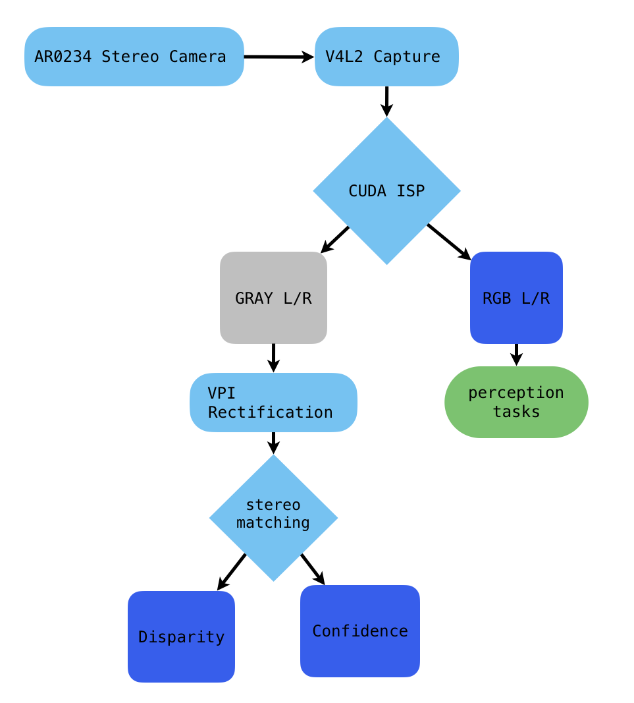

# Parallax

Active tracking infrastructure for spatial reasoning systems

GPU-accelerated perception system built around stereo vision on NVIDIA Jetson. The `2.0` baseline establishes the native camera-to-stereo pipeline without ROS 2.

## Current Pipeline



The current implementation keeps image processing GPU-resident through ISP, rectification, and stereo matching. The ISP produces both RGB and grayscale outputs so downstream consumers can use the appropriate representation without redundant conversion.

## Components

```text
camera/     V4L2 capture, Arducam control, configuration
cuda/       CUDA memory and processing utilities
isp/        Bayer demosaic and RGB/grayscale output
vpi/        CUDA image wrappers and stream management
stereo/     calibration, rectification, disparity
```

The stereo runtime consumes offline calibration artifacts including rectification maps, `R1`, `R2`, `P1`, `P2`, and `Q`.

## Build

```bash
cmake -S . -B build
cmake --build build -j"$(nproc)"
./build/parallax
```

Current native dependencies include C++17, CUDA, NVIDIA VPI, OpenCV, yaml-cpp, and CMake.

## Engineering Documentation

The current stereo implementation represents a verified baseline before the runtime pipeline refactor.

- [`docs/architecture/stereo_pipeline.md`](docs/stereo_arch.md) — design decisions and component boundaries
- [`docs/verification/stereo_pipeline.md`](docs/stereo_verification.md) — verification evidence, constraints, and known failure modes
- [`docs/roadmap.md`](docs/roadmap.md) — current architectural direction

## Direction

The next stage moves orchestration out of `main.cpp` into a runtime pipeline capable of managing independently enabled processing modules.

Planned downstream work includes depth and 3D geometry, Foxglove integration, nanobind bindings, object detection and tracking, VIO/VSLAM, LiDAR integration, and exploring shared spatial representation.